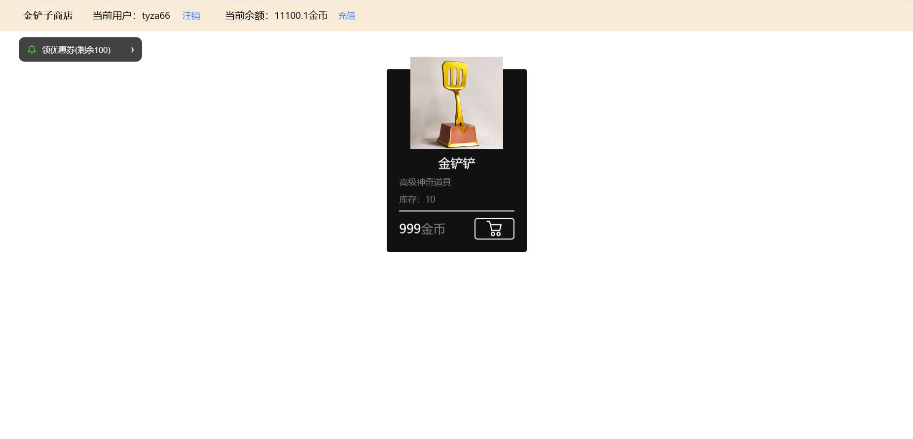
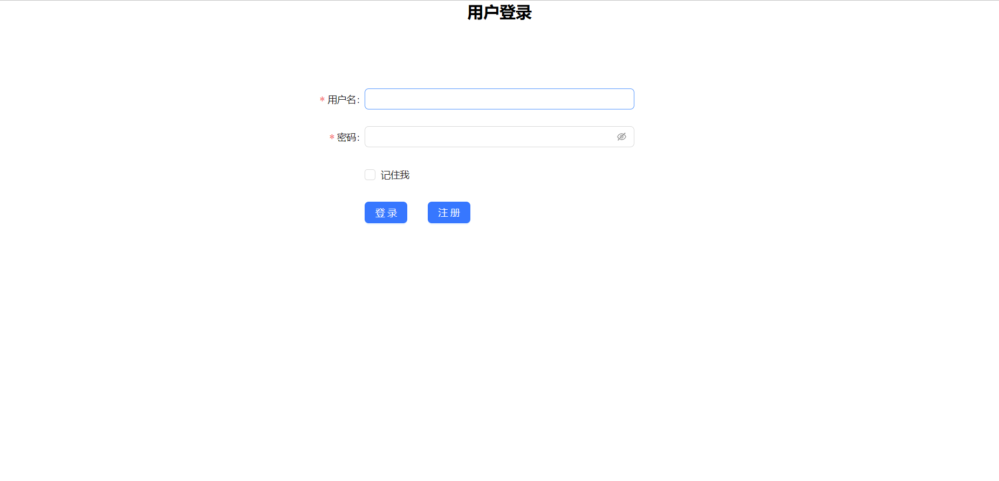
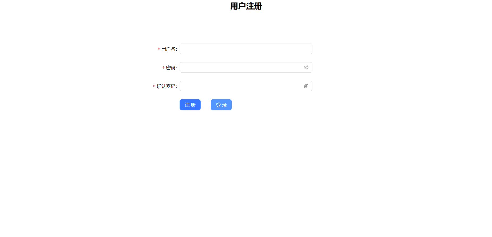
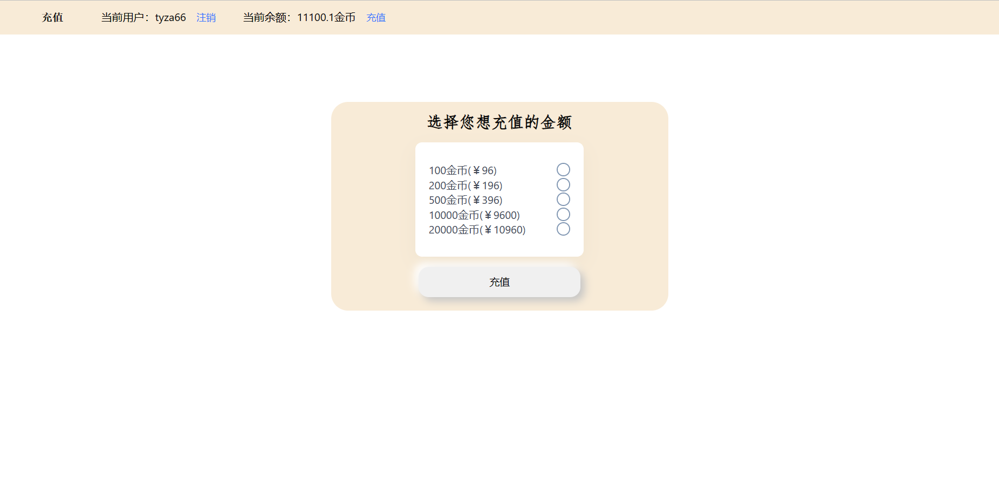
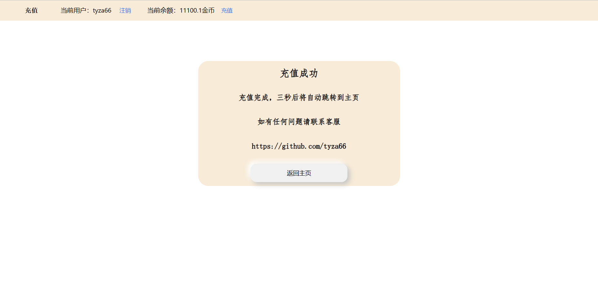
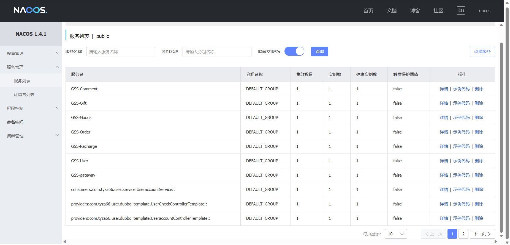

# GoldenShovelShop
### 金铲子商店
- 一个简单的*Spring Cloud Alibaba全家桶*微服务项目
- 实现充值式商城，用户可以通过充值金币来购买商品
- 实现用户、商品、订单、库存、优惠券等模块
- 分布式后端，完全前后端分离，使用网关解决负载均衡和跨域问题
- 用户密码使用SHA1加密

##### 设计图

##### 演示图

主页

用户登录

用户注册

用户充值

充值成功

注册中心

##### 使用技术
- 环境：Java8、Node、React、MySQL8+、Nacos1.4.1、Docker、Sentinel1.8、Seata1.3、Redis
- 后端技术栈：Spring、Spring Boot、Spring Cloud、Spring Cloud Alibaba、Junit、Lombok、Sa-Token系列、MyBatis、MyBatis Plus、Hutool、Sentinel、Seata、Jackson、Dubbo、Lettuce
- 前端技术栈：React、Ant Design、Axios、React Router、uiverse.io

##### Nacos注册中心
- 使用MySql数据库实现配置持久化
- 使用Nacos注册中心管理全局的服务和网关

##### 服务端口列表
- Nacos(注册中心)：8848
- Sentinel(流控降级)：9091
- RocketMQ控制台：8080
- React(前端页面)：3000
- GSS-Gateway(Gateway网关)：9090
- GSS-User(用户服务)：9601
- GSS-Goods(商品服务)：9602
- GSS-Recharge(充值服务)：9603
- GSS-Order(订单管理)：9604
- GSS-Gift(活动管理)：9605

##### 文件对应列表
- 微服务后端：GoldenShovelShop-SC
- React-AntD前端：goldenshovelshop-ad
- 文档：文档

##### 本地复现
- 配置好本地数据库和数据库表
- 安装好Spring Boot全家桶需要的环境（Java、Maven、Seata、Sentinel、Nacos），并且保证环境版本之间相互配套，部署和配置好各个环境，修改各个服务中的一些配置，运行所有服务
- npm i 初始化前端Node项目，运行
- 进入localhost:3000访问前端页面

##### Q&A
- Q：怎么保证充值服务的安全性？ A：使用Seata分布式事务，保证充值服务的原子性
- Q：怎么保证用户密码的安全性？ A：保存的密码使用SHA1加密后进行保存
- Q：怎么保证账户的安全性？ A：使用Sa-Token进行用户的登录验证
- Q：怎么实现的全局登录状态验证？ A：使用Sa-Token集成Redis和Sa-Token继承Dubbo，并且遵循Sa-Token的前后端分离写法，手动保存cookie，并且手动向请求头中加入token，并且实现分布式Session的功能

##### 用户权限代码表
- 普通用户：0
- 管理员：1

##### 返回code表
- 接口限流（未处理）：100
- 服务降级（未处理）：101
- 热点参数限流（未处理）：102
- 触发系统保护规则（未处理）：103
- 授权规则不通过（未处理）：104
- 成功：200
- 权限不足：201
- 失败：202
- 错误：203

By：tyza66